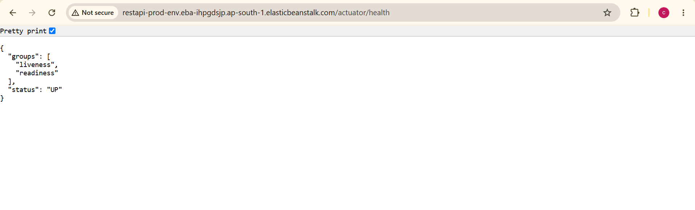
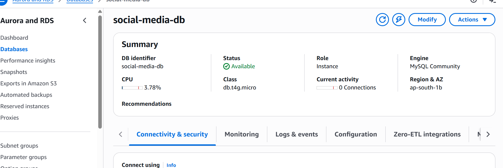

# 02-rest-api-mysql - Spring Boot REST API on AWS

## 🎯 Project Overview
End-to-end deployment of Spring Boot REST API with MySQL database.
Deployed on AWS Elastic Beanstalk with RDS MySQL as backend.

## 📸 Deployment Proof - Complete AWS Pipeline

### 1. Build Success - Maven

*Maven Build: SUCCESS | JUnit Tests: 1 Passed, 0 Failed*

### 2. Application Live - Elastic Beanstalk

*Spring Boot API running | Platform: Corretto 17 on Amazon Linux 2023*

### 3. Database Created - AWS RDS MySQL

*DB Identifier: social-media-db | Status: Available | Engine: MySQL Community*
*Instance Class: db.t4g.micro | Region: ap-south-1 Mumbai*

## 📖 Detailed Deployment Steps
For complete AWS setup, configuration, and steps → [View Documentation](02-rest-api-mysql-Deployment.md)

## 🔧 Tech Stack & AWS Services
- **Backend**: Java 17, Spring Boot 3.x
- **Database**: MySQL via AWS RDS 
- **Cloud**: AWS Elastic Beanstalk, EC2
- **Build Tool**: Maven
- **Testing**: JUnit

## 📝 What I Achieved
1. Created AWS RDS MySQL instance `social-media-db` - Status: Available
2. Built Spring Boot JAR and deployed on Elastic Beanstalk
3. Verified environment health: OK
4. End-to-end cloud deployment from code to database

## 💡 Note
AWS resources deleted post-verification to manage costs. Screenshots serve as deployment proof.

## 👨‍💻 About Me
Returning to tech after 10yr career gap | AWS + Spring Boot Projects  
LinkedIn: [Add your LinkedIn]

---
*Production-ready cloud deployment project for portfolio*
